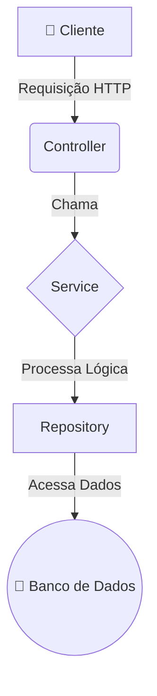

# 🏨 Hotel Bela Vista - Sistema de Gestão de Hóspedes

<div align="center">

    

</div>

API RESTful completa para gestão de um hotel, desenvolvida com Spring Boot. O sistema permite o gerenciamento de hóspedes, controle de reservas, processos de check-in e check-out, e cálculo automático de custos de hospedagem, com foco em robustez e integridade de dados.

---

### 📋 Índice

- [🎯 Visão Geral](#-visão-geral)
- [🏗️ Arquitetura](#️-arquitetura)
- [✔️ Checklist de Entidades e Atributos](#️-checklist-de-entidades-e-atributos)
- [✨ Funcionalidades e Regras de Negócio](#-funcionalidades-e-regras-de-negócio)
- [💻 Tecnologias Utilizadas](#-tecnologias-utilizadas)
- [🚀 Endpoints da API](#-endpoints-da-api)
- [📈 Histórico de Melhorias e Correções](#-histórico-de-melhorias-e-correções)
- [⚙️ Como Executar o Projeto](#️-como-executar-o-projeto)
- [📖 Documentação Swagger](#-documentação-swagger)
- [👨‍💻 Autor](#-autor)

---

### 🎯 Visão Geral

O **Belavista-Backend** é uma API RESTful projetada para simplificar a administração de um hotel, oferecendo funcionalidades para cadastrar hóspedes, gerenciar o ciclo de vida completo de uma reserva e controlar os processos de faturamento de forma eficiente, automatizada e segura.

### 🏗️ Arquitetura

A aplicação foi desenvolvida seguindo uma **arquitetura em camadas** para garantir a separação de responsabilidades, escalabilidade e manutenibilidade.



-   **Controller**: Camada de entrada da API, responsável por expor os endpoints e receber as requisições.
-   **Service**: Onde reside a lógica de negócio, regras e validações do sistema.
-   **Repository**: Camada de acesso a dados, que utiliza Spring Data JPA para interagir com o banco de dados.
-   **Exception**: Handler global para tratamento centralizado de erros, garantindo respostas padronizadas.
-   **Config**: Configurações de CORS e injeção de beans (Clock).

### ✔️ Checklist de Entidades e Atributos

Este é o modelo de dados principal da aplicação.

#### `Hospede.java`
| Atributo | Tipo | Descrição |
| :--- | :--- | :--- |
| `id` | `Long` | Identificador único do hóspede. |
| `nome` | `String` | Nome completo do hóspede. |
| `documento` | `String` | Documento de identificação (único). |
| `telefone` | `String` | Telefone de contato. |
| `reservas`| `List<Reserva>` | Lista de todas as reservas associadas a este hóspede. |

#### `Reserva.java`
| Atributo | Tipo | Descrição |
| :--- | :--- | :--- |
| `id` | `Long` | Identificador único da reserva. |
| `dataEntrada` | `LocalDateTime` | Data e hora exatas do check-in. |
| `dataSaida` | `LocalDateTime` | Data e hora exatas do check-out. |
| `adicionalVeiculo` | `boolean` | Indica se o hóspede utilizou a garagem. |
| `valorTotal` | `BigDecimal` | Custo total final da hospedagem. |
| `status` | `StatusReserva` | O estado atual da reserva. |
| `hospede` | `Hospede` | O hóspede associado a esta reserva. |

#### `StatusReserva.java` (Enum)
| Valor | Descrição |
| :--- | :--- |
| `PENDENTE` | Reserva criada, aguardando a chegada do hóspede. |
| `CONFIRMADA` | Status legado, pode ser usado para reservas pagas antecipadamente. |
| `CHECK_IN` | O hóspede já está no hotel. |
| `CHECK_OUT` | O hóspede finalizou a estadia e a fatura foi gerada. |
| `CANCELADA` | A reserva foi cancelada antes do check-in. |

### ✨ Funcionalidades e Regras de Negócio

-   ✅ **Gestão de Hóspedes**: CRUD completo para hóspedes, com busca por nome, documento ou telefone.
-   🏨 **Gestão de Reservas**: Criação e listagem de reservas com filtro por status.
-   🛡️ **Validações de Integridade**:
    -   Não permite excluir um hóspede que possua reservas ativas (`CONFIRMADA` ou `CHECK_IN`).
    -   Não permite criar uma reserva com data de saída anterior à de entrada.
    -   Não permite que um mesmo hóspede tenha reservas com datas sobrepostas.
-   🕒 **Processo de Check-in**: Altera o status da reserva para `CHECK_IN` e registra a data de entrada exata.
-   💳 **Processo de Check-out**: Finaliza a estadia, calcula o custo total e gera um relatório detalhado e estruturado.
-   💰 **Cálculo de Custos**:
    -   Diárias de **R$ 120,00** (dias de semana) e **R$ 180,00** (fins de semana).
    -   Adicional de garagem de **R$ 15,00** (dias de semana) e **R$ 20,00** (fins de semana).
    -   Aplicação de **multa de 50%** sobre o valor da última diária por check-out realizado após as 12:00.

### 💻 Tecnologias Utilizadas

| Categoria | Tecnologia | Versão |
| :--- | :--- | :--- |
| **Linguagem** | ☕ Java | 17 |
| **Framework** | 🌱 Spring Boot | 3.3.3 |
| **API** | 🌐 Spring Web | - |
| **Persistência** | 🗃️ Spring Data JPA & Hibernate | - |
| **Banco de Dados** | 🐘 PostgreSQL | 13+ |
| **Build** | 📦 Maven | 4.0.0 |
| **Documentação** | 📖 Springdoc (Swagger) | 2.5.0 |
| **Testes** | 🧪 JUnit 5 & Mockito | - |
| **Utilitários** | 📄 Lombok | - |

### 🚀 Endpoints da API

#### Módulo de Hóspedes (`/api/hospedes`)
| Método | Rota | Descrição |
| :--- | :--- | :--- |
| `POST` | `/` | Cria um novo hóspede. |
| `GET` | `/` | Lista/Busca hóspedes por nome, documento ou telefone. |
| `GET` | `/{id}` | Busca um hóspede por ID. |
| `PUT` | `/{id}` | Atualiza um hóspede existente. |
| `DELETE` | `/{id}` | Remove um hóspede. |

#### Módulo de Reservas (`/api/reservas`)
| Método | Rota | Descrição |
| :--- | :--- | :--- |
| `POST` | `/` | Cria uma nova reserva. |
| `GET` | `/` | Lista reservas, com filtro opcional por `status`. |
| `POST` | `/{id}/check-in` | Realiza o check-in de uma reserva. |
| `POST` | `/{id}/check-out` | Realiza o check-out e calcula os custos. |

### 📈 Histórico de Melhorias e Correções

Durante o desenvolvimento, diversos pontos foram refinados para garantir a robustez e a qualidade do sistema:

-   **Correção de Lógica de Negócio:** Ajustado o valor da diária de fim de semana para R$ 180,00, conforme os requisitos.
-   **Correção de Testes Unitários:** Refatorados os testes de `BigDecimal` para usar `compareTo`, evitando falhas por diferença de escala.
-   **Correção de Serialização JSON:** Resolvido um problema de loop infinito (`StackOverflowError`) na serialização de entidades com relacionamento bidirecional (`Hospede` <-> `Reserva`) através do uso de `@JsonIgnore`.
-   **Correção de Validação de Dados:** Adicionada validação (`@NotNull`) para o `idHospede` na criação de reservas, evitando `NullPointerException` e retornando um erro `400 Bad Request` claro para o cliente.
-   **Refatoração de Fatura:** A resposta do endpoint de check-out foi melhorada, passando de uma simples `List<String>` para uma lista de `DetalheCustoDTO`, fornecendo dados estruturados para o frontend.
-   **Blindagem de Processos:** Implementadas validações para impedir a exclusão de hóspedes com reservas ativas e a criação de reservas com datas sobrepostas ou inválidas.
-   **Centralização de Mensagens:** Todas as mensagens de erro e validação foram movidas para um arquivo `messages.properties`, preparando o sistema para internacionalização (i18n) e facilitando a manutenção.

### ⚙️ Como Executar o Projeto

1.  **Pré-requisitos:**
    -   Java Development Kit (JDK) v17 ou superior.
    -   Apache Maven v3.8 ou superior.
    -   PostgreSQL v13 ou superior.

2.  **Clone o repositório:**
    ```sh
    git clone https://github.com/seu-usuario/belavista-backend.git
    cd belavista-backend
    ```
3.  **Configure o Banco de Dados:**
    -   Certifique-se de que o PostgreSQL está instalado e em execução.
    -   Crie um novo banco de dados: `CREATE DATABASE belavista;`
    -   Ajuste as credenciais no arquivo `src/main/resources/application.properties` se necessário.

4.  **Execute a aplicação:**
    ```sh
    mvn spring-boot:run
    ```

A aplicação estará disponível em `http://localhost:8080`.

### 📖 Documentação Swagger

Para explorar e testar todos os endpoints de forma interativa, acesse a documentação do Swagger UI no seu navegador após iniciar a aplicação:

**URL:** [http://localhost:8080/swagger-ui.html](http://localhost:8080/swagger-ui.html)

### 👨‍💻 Autor

Desenvolvido com ❤️ por **Daniel Silva**.
