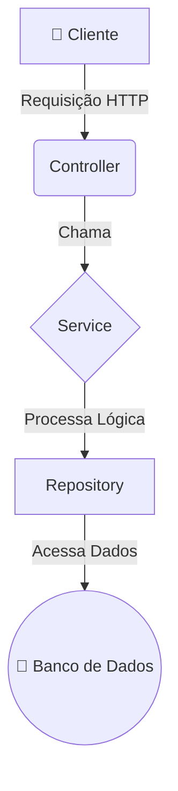

# 🏨 Hotel Bela Vista - Sistema de Gestão de Hóspedes

<div align="center">

    

</div>

API RESTful completa para gestão de um hotel, desenvolvida com Spring Boot. O sistema permite o gerenciamento de hóspedes, controle de reservas, processos de check-in e check-out, e cálculo automático de custos de hospedagem.

---

### 📋 Índice

- [🎯 Visão Geral](#-visão-geral)
- [🏗️ Arquitetura](#️-arquitetura)
- [💻 Tecnologias Utilizadas](#-tecnologias-utilizadas)
- [✨ Funcionalidades](#-funcionalidades)
- [🚀 Endpoints da API](#-endpoints-da-api)
- [⚙️ Como Executar o Projeto](#️-como-executar-o-projeto)
- [📖 Documentação Swagger](#-documentação-swagger)
- [👨‍💻 Autor](#-autor)

---

### 🎯 Visão Geral

O **Belavista** é uma API RESTful projetada para simplificar a administração de um hotel, oferecendo funcionalidades para cadastrar hóspedes, gerenciar reservas, e controlar os processos de check-in e check-out de forma eficiente e automatizada.

### 🏗️ Arquitetura

A aplicação foi desenvolvida seguindo uma **arquitetura em camadas** para garantir a separação de responsabilidades, escalabilidade e manutenibilidade.



-   **Controller**: Camada de entrada da API, responsável por expor os endpoints e receber as requisições.
-   **Service**: Onde reside a lógica de negócio, regras e validações do sistema.
-   **Repository**: Camada de acesso a dados, que utiliza Spring Data JPA para interagir com o banco de dados.

### 💻 Tecnologias Utilizadas

| Tecnologia | Versão | Descrição |
| :--- | :--- | :--- |
| ☕ **Java** | 17 | Linguagem de programação principal. |
| 🌱 **Spring Boot** | 3.3.3 | Framework para criação da aplicação e API REST. |
| 📦 **Maven** | 4.0.0 | Gerenciador de dependências e build do projeto. |
| 🐘 **PostgreSQL** | 13+ | Banco de dados relacional para persistência dos dados. |
| 🗃️ **Spring Data JPA** | - | Camada de persistência para interação com o banco de dados. |
| 📝 **Bean Validation** | - | Validação dos dados de entrada. |
|  📄 **Lombok** | - | Redução de código boilerplate. |
| 📖 **Springdoc (Swagger)** | 2.5.0 | Geração de documentação interativa da API. |
| 🧪 **JUnit 5 & Mockito** | - | Frameworks para testes unitários. |

### ✨ Funcionalidades

-   ✅ **Gestão de Hóspedes**: CRUD completo para hóspedes, com busca por nome, documento ou telefone.
-   🏨 **Gestão de Reservas**: Criação e listagem de reservas com status (`PENDENTE`, `CHECK_IN`, `CHECK_OUT`).
-   🕒 **Processo de Check-in**: Altera o status da reserva e registra a data de entrada.
-   💳 **Processo de Check-out**: Finaliza a estadia, calcula o custo total e gera um relatório detalhado.
-   💰 **Cálculo de Custos**:
    -   Diárias diferenciadas para dias de semana e fins de semana.
    -   Custo adicional para uso de estacionamento.
    -   Aplicação de multa por check-out tardio.
-   🛡️ **Tratamento de Exceções**: Respostas de erro padronizadas para uma melhor experiência do cliente da API.

### 🚀 Endpoints da API

A seguir, a lista de endpoints disponíveis na aplicação.

#### Módulo de Hóspedes

| Método | Endpoint | Descrição |
| :--- | :--- | :--- |
| `POST` | `/api/hospedes` | Cria um novo hóspede. |
| `GET` | `/api/hospedes` | Lista/Busca hóspedes por nome, documento ou telefone. |
| `GET` | `/api/hospedes/{id}` | Busca um hóspede por ID. |
| `PUT` | `/api/hospedes/{id}` | Atualiza um hóspede existente. |
| `DELETE` | `/api/hospedes/{id}` | Remove um hóspede. |

*Exemplo de corpo para `POST /api/hospedes`:*
```json
{
  "nome": "João da Silva",
  "documento": "123.456.789-00",
  "telefone": "(11) 98765-4321"
}
```

#### Módulo de Reservas

| Método | Endpoint | Descrição |
| :--- | :--- | :--- |
| `POST` | `/api/reservas` | Cria uma nova reserva. |
| `POST` | `/api/reservas/{id}/check-in` | Realiza o check-in de uma reserva. |
| `POST` | `/api/reservas/{id}/check-out` | Realiza o check-out e calcula os custos. |
| `GET` | `/api/reservas` | Lista reservas, com filtro opcional por status. |

*Exemplo de corpo para `POST /api/reservas`:*
```json
{
  "idHospede": 1,
  "dataEntrada": "2025-12-20T14:00:00",
  "dataSaidaPrevista": "2025-12-22T12:00:00",
  "adicionalVeiculo": true
}
```

*Exemplo de resposta para `POST /api/reservas/{id}/check-out`:*
```json
{
  "detalhesDiarias": [
    "Diária 2025-12-20: R$180.00",
    "Diária 2025-12-21: R$180.00",
    "Diária 2025-12-22: R$120.00"
  ],
  "valorTotalDiarias": 480.00,
  "valorTotalEstacionamento": 55.00,
  "valorMultaAtraso": 60.00,
  "valorTotalGeral": 595.00
}
```

### ⚙️ Como Executar o Projeto

1.  **Clone o repositório:**
    ```sh
    git clone https://github.com/seu-usuario/belavista.git
    cd belavista
    ```
2.  **Configure o Banco de Dados:**
    -   Crie um banco de dados PostgreSQL.
    -   Atualize as credenciais no arquivo `src/main/resources/application.properties`.
3.  **Execute a aplicação:**
    ```sh
    mvn spring-boot:run
    ```

A aplicação estará disponível em `http://localhost:8080`.

### 📖 Documentação Swagger

Para explorar e testar os endpoints de forma interativa, acesse a documentação do Swagger UI no seu navegador:

**URL:** [http://localhost:8080/swagger-ui.html](http://localhost:8080/swagger-ui.html)

### 👨‍💻 Autor

Desenvolvido com ❤️ por **Daniel Silva**.
