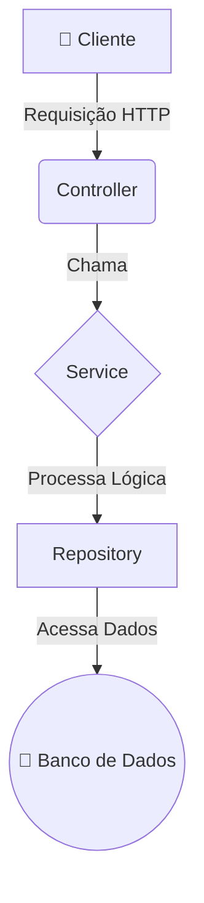

# 🏨 Hotel Bela Vista - Sistema de Gestão de Hóspedes

    

API RESTful completa para gestão de um hotel, desenvolvida com Spring Boot, seguindo as melhores práticas de arquitetura e robustez de processos de negócio.

---

### 📋 Índice

- [🎯 Visão Geral](#-visão-geral)
- [✅ Checklist de Requisitos e Correções](#-checklist-de-requisitos-e-correções)
- [🏗️ Arquitetura](#️-arquitetura)
- [💻 Tecnologias Utilizadas](#-tecnologias-utilizadas)
- [🚀 Endpoints da API](#-endpoints-da-api)
- [⚙️ Como Executar o Projeto](#️-como-executar-o-projeto)
- [📖 Documentação Swagger](#-documentação-swagger)

---

### 🎯 Visão Geral

O **Belavista** é uma API RESTful projetada para simplificar a administração de um hotel, oferecendo funcionalidades para cadastrar hóspedes, gerenciar o ciclo de vida completo de uma reserva (criação, check-in, check-out, cancelamento) e calcular os custos de hospedagem de forma automatizada e precisa.

O projeto foi desenvolvido com foco na **robustez dos processos de negócio**, garantindo a integridade dos dados e fornecendo um tratamento de erros claro e consistente.

### ✅ Checklist de Requisitos e Correções

Esta seção detalha o status de cada requisito solicitado e as principais correções e melhorias de arquitetura implementadas durante o desenvolvimento.

#### Requisitos Funcionais

| Requisito | Status | Implementação |
| :--- | :--- | :--- |
| Armazenar Hóspedes | ✅ **Concluído** | `Hospede.java`, `HospedeRepository` |
| Armazenar Reservas | ✅ **Concluído** | `Reserva.java`, `ReservaRepository` |
| Localizar Hóspedes (Nome, Doc, Tel) | ✅ **Concluído** | `HospedeServiceImpl` e `HospedeController` |
| Localizar Hóspedes Hospedados | ✅ **Concluído** | `GET /api/reservas?status=CHECK_IN` |
| Localizar com Reservas Pendentes | ✅ **Concluído** | `GET /api/reservas?status=PENDENTE` |
| Realizar Check-in | ✅ **Concluído** | `POST /api/reservas/{id}/check-in` |
| Realizar Check-out | ✅ **Concluído** | `POST /api/reservas/{id}/check-out` |
| Calcular Diárias (Semana/Fim de Semana) | ✅ **Concluído** | Lógica em `ReservaServiceImpl` |
| Cobrar Adicional de Veículo | ✅ **Concluído** | Lógica em `ReservaServiceImpl` |
| Restringir Horário de Check-in | ✅ **Concluído** | Validação no `ReservaServiceImpl` |
| Restringir Horário/Multa de Check-out | ✅ **Concluído** | Validação no `ReservaServiceImpl` |
| Exibir Detalhes da Fatura | ✅ **Concluído** | `CheckoutResponseDTO` com `List<DetalheCustoDTO>` |

#### Modelo de Dados e Atributos

-   **`Hospede.java`**: `id`, `nome`, `documento`, `telefone`, `reservas`.
-   **`Reserva.java`**: `id`, `hospede`, `dataEntrada`, `dataSaida`, `adicionalVeiculo`, `status`, `valorTotal`.
-   **`StatusReserva.java` (Enum)**: `PENDENTE`, `CHECK_IN`, `CHECK_OUT`, `CANCELADA`.
-   **DTOs**: `ReservaRequestDTO`, `CheckoutResponseDTO`, `DetalheCustoDTO`, `ErrorResponseDTO` para padronização de respostas.

#### Correções e Melhorias de Arquitetura

-   **Blindagem de Processos de Negócio:**
    -   🛡️ **Exclusão de Hóspedes:** Implementada uma trava que impede a exclusão de um hóspede se ele possuir reservas ativas (`PENDENTE` ou `CHECK_IN`), garantindo a integridade referencial dos dados (`HospedeComReservaAtivaException`).
    -   🛡️ **Criação de Reservas:** Adicionadas validações para impedir a criação de reservas com data de saída anterior à de entrada (`DataInvalidaException`) e para evitar a sobreposição de datas para o mesmo hóspede (`ReservaSobrepostaException`).

-   **Evolução do Modelo de Dados:**
    -   🧾 **Fatura Detalhada:** O DTO de resposta do check-out (`CheckoutResponseDTO`) foi refatorado. Em vez de uma simples lista de textos, ele agora utiliza uma lista de `DetalheCustoDTO`, fornecendo dados estruturados para o frontend e desacoplando a lógica de formatação.

-   **Correções de Backend e Sincronização:**
    -   🐞 **Serialização JSON:** Resolvido um problema de loop infinito (referência circular) entre as entidades `Hospede` e `Reserva` utilizando a anotação `@JsonIgnore`, garantindo que as respostas da API sejam geradas corretamente.
    -   🐞 **Persistência de Enums:** Garantido que o `StatusReserva` seja salvo no banco de dados como `String` (`@Enumerated(EnumType.STRING)`) e que o schema seja recriado (`ddl-auto=create-drop`) para evitar erros de `CHECK constraint` com o PostgreSQL.
    -   🐞 **Validação de DTOs:** Adicionada validação (`@NotNull`) nos DTOs de entrada para garantir que dados essenciais (como `idHospede`) não cheguem nulos ao serviço, retornando um erro `400 Bad Request` claro em vez de um `500 Internal Server Error`.
    -   🐞 **Compatibilidade de Dependências:** Ajustada a versão do Spring Boot no `pom.xml` para `3.3.3` para garantir compatibilidade total com a biblioteca de documentação `springdoc-openapi`.

-   **Centralização de Mensagens:**
    -   🌐 Implementado um sistema de mensagens centralizado com `messages.properties` e o `MessageSource` do Spring. Todas as mensagens de erro e validação da aplicação agora vêm de uma única fonte, facilitando a manutenção e preparando o sistema para internacionalização (i18n).

### 🏗️ Arquitetura

A aplicação foi desenvolvida seguindo uma **arquitetura em camadas** para garantir a separação de responsabilidades, escalabilidade e manutenibilidade.

-   **Controller**: Camada de entrada da API, responsável por expor os endpoints e receber as requisições.
-   **Service**: Onde reside a lógica de negócio, regras e validações do sistema.
-   **Repository**: Camada de acesso a dados, que utiliza Spring Data JPA para interagir com o banco de dados.

### 💻 Tecnologias Utilizadas

| Categoria | Tecnologia | Versão/Padrão |
| :--- | :--- | :--- |
| **Linguagem & Framework** | ☕ Java | 17 |
| | 🌱 Spring Boot | 3.3.3 |
| **Acesso a Dados** | 🐘 PostgreSQL | 13+ |
| | 🗃️ Spring Data JPA | - |
| **API & Web** | 🌐 Spring Web | - |
| | 📖 Springdoc (Swagger) | 2.5.0 |
| **Build & Utilitários** | 📦 Maven | 4.0.0 |
| | 📄 Lombok | - |
| **Validação** | 📝 Bean Validation | - |
| **Testes** | 🧪 JUnit 5 & Mockito | - |

### 🚀 Endpoints da API

A seguir, a lista de endpoints disponíveis na aplicação.

#### Módulo de Hóspedes

| Método | Endpoint | Descrição |
| :--- | :--- | :--- |
| `POST` | `/api/hospedes` | Cria um novo hóspede. |
| `GET` | `/api/hospedes` | Lista/Busca hóspedes por nome, documento ou telefone. |
| `GET` | `/api/hospedes/{id}` | Busca um hóspede por ID. |
| `PUT` | `/api/hospedes/{id}` | Atualiza um hóspede existente. |
| `DELETE` | `/api/hospedes/{id}` | Remove um hóspede. |

#### Módulo de Reservas

| Método | Endpoint | Descrição |
| :--- | :--- | :--- |
| `POST` | `/api/reservas` | Cria uma nova reserva. |
| `POST` | `/api/reservas/{id}/check-in` | Realiza o check-in de uma reserva. |
| `POST` | `/api/reservas/{id}/check-out` | Realiza o check-out e calcula os custos. |
| `GET` | `/api/reservas` | Lista reservas, com filtro opcional por status. |
| `DELETE` | `/api/reservas/{id}` | Cancela uma reserva com status `PENDENTE`. |

### ⚙️ Como Executar o Projeto

1.  **Pré-requisitos:**
    -   Java Development Kit (JDK) v17 ou superior.
    -   Apache Maven v3.8 ou superior.
    -   PostgreSQL v13 ou superior.
    -   Uma IDE de sua preferência (ex: IntelliJ IDEA, VS Code).

2.  **Configuração do Banco de Dados:**
    -   Certifique-se de que o PostgreSQL está instalado e em execução.
    -   Crie um novo banco de dados: `CREATE DATABASE belavista;`
    -   Ajuste as credenciais (`username`, `password`) no arquivo `src/main/resources/application.properties`.

3.  **Execução:**
    -   Clone o repositório.
    -   Abra um terminal na raiz do projeto.
    -   Execute o comando: `mvn clean install` para compilar e rodar os testes.
    -   Inicie a aplicação: `mvn spring-boot:run`
    -   A API estará disponível em `http://localhost:8080`.

### 📖 Documentação Swagger

Para explorar e testar os endpoints de forma interativa, acesse a documentação do Swagger UI no seu navegador após iniciar a aplicação:

-   **URL:** [http://localhost:8080/swagger-ui.html](http://localhost:8080/swagger-ui.html)
